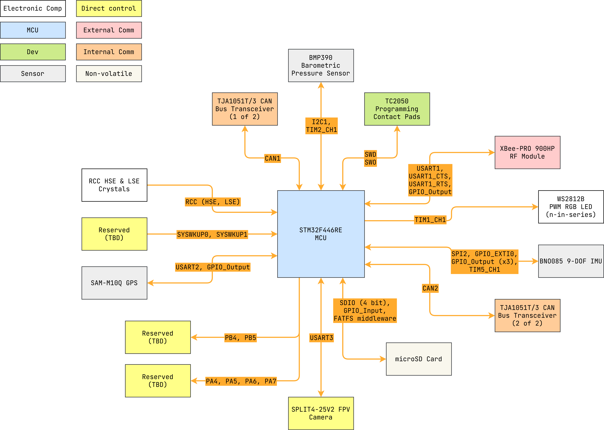

# nerve


STM32F446RE with telemetry ICs.

---

<details markdown="1">
  <summary>Table of Contents</summary>

<!-- TOC -->
* [nerve](#nerve)
  * [1 Overview](#1-overview)
    * [1.1 Bill of Materials (BOM)](#11-bill-of-materials-bom)
    * [1.2 Block Diagram](#12-block-diagram)
    * [1.3 Pin Configurations](#13-pin-configurations)
    * [1.4 Clock Configurations](#14-clock-configurations)
  * [2 BNO085 9-DOF IMU](#2-bno085-9-dof-imu)
    * [2.1 Background](#21-background)
    * [2.2 Serial Peripheral Interface (SPI)](#22-serial-peripheral-interface-spi)
      * [2.2.1 Full-Duplex vs. Half-Duplex](#221-full-duplex-vs-half-duplex)
      * [2.2.2 Clock Polarity, Phase and Modes](#222-clock-polarity-phase-and-modes)
      * [2.2.3 Clock Rate](#223-clock-rate)
    * [2.3 General-Purpose Input/Output (GPIO) Output](#23-general-purpose-inputoutput-gpio-output)
    * [2.4 Timer](#24-timer)
      * [2.4.1 Timer Prescaler Calculation](#241-timer-prescaler-calculation)
    * [2.5 Nested Vectored Interrupt Controller (NVIC)](#25-nested-vectored-interrupt-controller-nvic)
      * [2.5.1 GPIO External Interrupt/Event Controller (EXTI)](#251-gpio-external-interruptevent-controller-exti)
    * [2.6 BNO085 Driver](#26-bno085-driver)
  * [3 BMP390 Barometric Pressure Sensor](#3-bmp390-barometric-pressure-sensor)
    * [3.1 Background](#31-background)
    * [3.2 Inter-Integrated Circuit (I2C)](#32-inter-integrated-circuit-i2c)
    * [3.3 Timer](#33-timer)
    * [3.4 BMP390 Driver](#34-bmp390-driver)
  * [4 TJA1051T/3 CAN Bus Transceiver](#4-tja1051t3-can-bus-transceiver)
    * [4.1 Background](#41-background)
    * [4.2 Controller Area Network (CAN)](#42-controller-area-network-can)
    * [4.2.1 Bit Time Calculation](#421-bit-time-calculation)
    * [4.3 CAN High-Level Driver](#43-can-high-level-driver)
  * [5 XBee-PRO 900HP Long Range 900 MHz OEM RF Module](#5-xbee-pro-900hp-long-range-900-mhz-oem-rf-module)
    * [5.1 Background](#51-background)
      * [5.1.1 XCTU Configuration](#511-xctu-configuration)
    * [5.2 Universal Synchronous/Asynchronous Receiver/Transmitter (USART)](#52-universal-synchronousasynchronous-receivertransmitter-usart)
      * [5.2.1 Direct Memory Access (DMA)](#521-direct-memory-access-dma)
    * [5.3 XBee Driver](#53-xbee-driver)
  * [6 SD Card](#6-sd-card)
    * [6.1 Secure Digital Input Output (SDIO)](#61-secure-digital-input-output-sdio)
      * [6.1.1 Direct Memory Access (DMA)](#611-direct-memory-access-dma)
      * [6.1.2 Nested Vectored Interrupt Controller (NVIC)](#612-nested-vectored-interrupt-controller-nvic)
    * [6.2 FATFS Middleware](#62-fatfs-middleware)
    * [6.3 SDIO High-Level Driver](#63-sdio-high-level-driver)
  * [7 SAM-M10Q RF Receiver Galileo, GLONASS, GPS](#7-sam-m10q-rf-receiver-galileo-glonass-gps)
    * [7.1 Background](#71-background)
    * [7.2 Universal Synchronous/Asynchronous Receiver/Transmitter (USART)](#72-universal-synchronousasynchronous-receivertransmitter-usart)
    * [7.3 SAM-M10Q Driver](#73-sam-m10q-driver)
  * [8 SPLIT4-25V2 UART FPV Camera](#8-split4-25v2-uart-fpv-camera)
    * [8.1 Background](#81-background)
    * [8.2 Universal Synchronous/Asynchronous Receiver/Transmitter (USART)](#82-universal-synchronousasynchronous-receivertransmitter-usart)
    * [8.3 SPLIT4-25V2 Driver](#83-split4-25v2-driver)
  * [9 WS2812B PWM Addressable RGB LED](#9-ws2812b-pwm-addressable-rgb-led)
    * [9.1 Clocks](#91-clocks)
    * [9.2 Pulse Width Modulation (PWM) Timer](#92-pulse-width-modulation-pwm-timer)
      * [9.2.1 Timer Calculations](#921-timer-calculations)
    * [9.3 Direct Memory Access (DMA)](#93-direct-memory-access-dma)
    * [9.4 Nested Vectored Interrupt Controller (NVIC)](#94-nested-vectored-interrupt-controller-nvic)
    * [9.5 WS2812B Driver](#95-ws2812b-driver)
      * [9.5.1 PWM Duty Cycle Calculations](#951-pwm-duty-cycle-calculations)
      * [9.5.2 Reset Code Time Periods Calculation](#952-reset-code-time-periods-calculation)
  * [10 Real Time Clock (RTC)](#10-real-time-clock-rtc)
  * [11 Shared Low-Level Software Features](#11-shared-low-level-software-features)
    * [11.1 Callbacks](#111-callbacks)
  * [12 Software Driven Features](#12-software-driven-features)
    * [12.1 Initialization Function](#121-initialization-function)
    * [12.2 Run](#122-run)
    * [12.3 Scheduler](#123-scheduler)
    * [12.4 Diagnostics](#124-diagnostics)
    * [12.5 Error Checking](#125-error-checking)
<!-- TOC -->

</details>

---

## 1 Overview

### 1.1 Bill of Materials (BOM)

| Manufacturer Part Number | Manufacturer            | Description                         | Quantity | Notes                              |
|--------------------------|-------------------------|-------------------------------------|---------:|------------------------------------|
| STM32F446RE              | STMicroelectronics      | 32-bit MCU                          |        1 |                                    |
| BNO085                   | CEVA Technologies, Inc. | 9-DOF IMU                           |        1 |                                    |
| BMP390                   | Bosch Sensortec         | Barometric Pressure Sensor          |        1 |                                    |
| TJA1051T/3               | NXP USA Inc.            | CAN Bus Transceiver                 |        2 |                                    |
| 0472192001               | Molex                   | microSD Hinged 8 Position Connector |        1 |                                    |
| SAM-M10Q                 | u-blox                  | RF Receiver Galileo, GLONASS, GPS   |        1 |                                    |
| XBee-PRO 900HP           | Digi                    | Long Range 900 MHz OEM RF Module    |        1 | Future: XBee SX 900 or XBee XR 900 |
| SPLIT4-25V2              | RunCam                  | UART FPV Camera                     |        1 |                                    |
| WS2812B                  | (Various)               | PWM Addressable RGB LED             |   (Many) |                                    |

### 1.2 Block Diagram



> Drawio file here: [nerve.drawio](docs/nerve.drawio)

### 1.3 Pin Configurations

<details markdown="1">
  <summary>CubeMX Pinout</summary>


</details>

<details markdown="1">
  <summary>Pin & Peripherals Table</summary>

| STM32F446RE | Peripheral              | Config                | Connection                       | Notes                                 |
|-------------|-------------------------|-----------------------|----------------------------------|---------------------------------------|
| PB3         | `SYS_JTDO-SWO`          |                       | TC2050 SWD Pin 6: `SWO`          |                                       |
| PA14        | `SYS_JTCK-SWCLK`        |                       | TC2050 SWD Pin 4: `SWCLK`        |                                       |
| PA13        | `SYS_JTMS-SWDIO`        |                       | TC2050 SWD Pin 2: `SWDIO`        |                                       |
|             | `TIM2_CH1`              | PWM no output         |                                  | BMP390 BMP3 driver timer.             |
|             | `TIM5_CH1`              | PWM no output         |                                  | BNO085 SH2 driver timer.              |
| PA0         | `SYS_WKUP0`             |                       | External                         |                                       |
| PC13        | `SYS_WKUP1`             |                       | External                         |                                       |
| PC7         | `SPI2_SCK`              |                       | BNO085 Pin 19: `H_SCL/SCK/RX`    |                                       |
| PC6         | `GPIO_Output` (SPI2 CS) | Pull-up, set high     | BNO085 Pin 18: `H_CSN`           |                                       |
| PB14        | `SPI2_MISO`             |                       | BNO085 Pin 20: `H_SDA/H_MISO/TX` |                                       |
| PB15        | `SPI2_MOSI`             |                       | BNO085 Pin 17: `SA0/H_MOSI`      |                                       |
| PC0         | `GPIO_EXTI0`            | Pull-up, falling edge | BNO085 Pin 14: `H_INTN`          |                                       |
| PA15        | `GPIO_Output`           |                       | BNO085 Pin 6: `PS0/Wake`         | Pull low to trigger wake.             |
|             |                         | Hardware pull-up      | BNO085 Pin 5: `PS1`              |                                       |
| PC9         | `GPIO_Output`           |                       | BNO085 Pin 11: `NRST`            | Pull low to reset.                    |
| PB6         | `I2C1_SCL`              |                       | BMP390 Pin 2: `SCK`              |                                       |
| PB7         | `I2C1_SDA`              |                       | BMP390 Pin 4: `SDI`              |                                       |
| PC10        | `GPIO_Output`           |                       | XBee-PRO 900HP Pin 6: `RESET`    | Pull low to reset.                    |
| PA10        | `USART1_RX`             | 115200 bps            | XBee-PRO 900HP Pin 3: `DOUT`     |                                       |
| PA9         | `USART1_TX`             | 115200 bps            | XBee-PRO 900HP Pin 4: `DIN`      |                                       |
| PA11        | `USART1_CTS`            |                       | XBee-PRO 900HP Pin 25: `CTS`     | Hardware flow control (RS232).        |
| PA12        | `USART1_RTS`            |                       | XBee-PRO 900HP Pin 29: `RTS`     | Hardware flow control (RS232).        |
| PA3         | `USART2_RX`             | 115200 bps            | SAM-M10Q Pin 13: `TXD`           |                                       |
| PA2         | `USART2_TX`             | 115200 bps            | SAM-M10Q Pin 14: `RXD`           |                                       |
| PA1         | `GPIO_Output`           |                       | SAM-M10Q Pin 18: `RESET_N`       | Pull low to reset (>= 1 ms).          |
| PC5         | `USART3_RX`             | 115200 bps            | SPLIT4-25V2                      |                                       |
| PB10        | `USART3_TX`             | 115200 bps            | SPLIT4-25V2                      |                                       |
| PB2         | `SDIO_CK`               |                       | MicroSD card: `CK`               |                                       |
| PD2         | `SDIO_CMD`              |                       | MicroSD card: `CMD`              |                                       |
| PC8         | `SDIO_D0`               |                       | MicroSD card: `D0`               |                                       |
| PB0         | `SDIO_D1`               | (Software configured) | MicroSD card: `D1`               | 4-bit mode is configured by software. |
| PB1         | `SDIO_D2`               | (Software configured) | MicroSD card: `D2`               | 4-bit mode is configured by software. |
| PC11        | `SDIO_D3`               | (Software configured) | MicroSD card: `D3`               | 4-bit mode is configured by software. |
| PC4         | `GPIO_Input`            | FATFS middleware      | MicroSD card: `Detect`           | High when SD card inserted, else GND. |
| PB8         | `CAN1_RX`               |                       | TJA1051T/3 (1 of 2) Pin 1: `TXD` |                                       |
| PB9         | `CAN1_TX`               |                       | TJA1051T/3 (1 of 2) Pin 4: `RXD` |                                       |
| PB12        | `CAN2_RX`               |                       | TJA1051T/3 (2 of 2) Pin 1: `TXD` |                                       |
| PB13        | `CAN2_TX`               |                       | TJA1051T/3 (2 of 2) Pin 4: `RXD` |                                       |
| PA8         | `TIM1_CH1`              | PWM Generation CH1    | WS2812B Pin: `DIN`               | DIN pin number depends on IC variant. |

Notes:

- PA4, PA5, PA6, PA7 can be configured for `SPI1_NSS`, `SPI_SCK`, `SPI1_MISO`
  and `SPI1_MOSI` respectively.
- PB4 and PB5 can be configured for `TIM3_CH1` and `TIM3_CH2` respectively.

</details>

### 1.4 Clock Configurations

```
8 MHz High Speed External (HSE)
↓
Phase-Locked Loop Main (PLLM)
↓
180 MHz SYSCLK
↓
180 MHz HCLK
↓
 → 45 MHz APB1 (Maxed) → 90 MHz APB1 Timer
 → 90 MHz APB2 (Maxed) → 180 MHz APB2 Timer

↓
48 MHz PLL48CLK
↓
48 MHz SDIO
```

---

## 2 BNO085 9-DOF IMU

9-axis Inertial Measurement Unit (IMU) combining an accelerometer, gyroscope,
and magnetometer, based on Bosch Sensortec's BNO080 hardware, with sensor fusion
firmware developed by CEVA, Inc. (formerly Hillcrest Laboratories).
(Non-standard) I2C and SPI capable.

> Utilized reference documents:
> 1. `1000-3535 - Sensor Hub Transport Protocol v1.8`
> 2. `1000-3600 - SH-2 SHTP Reference Manual v1.5_1`
> 3. `1000-3625 - SH-2 Reference Manual v1.4`
> 4. `1000-3918 - BNO080 Migration_1`
> 5. `1000-3927 - BNO080 Datasheet v1.6`
> 6. `1000-4044 - BNO080-BNO085 Sensor Calibration Procedure v1.3`
> 7. `1000-4045 - App Note - BNO080-BNO085 Tare Function Usage Guide_1`
> 8. `HillcrestLabs BNO080-085 DataSheet_C`

### 2.1 Background

The BNO085 runs the same hardware as the BNO080, however runs custom Sensor Hub
2 (SH-2) firmware to reduce development overhead on features related to sensor
fusion and optimization. SH-2 is designed around the Sensor Hub Transport
Protocol (SHTP), which runs on SPI, I2C, etc.

### 2.2 Serial Peripheral Interface (SPI)

In an SPI setup, there is always one controller (master) connected to one or
more peripherals (slaves). The controller controls the communication by
generating a clock signal (SCK) and selecting which slave to communicate with
using the Chip Select (CS) line. Data is exchanged between the controller and
peripheral(s) over two data lines: COPI/MOSI and CIPO or MISO.

Basic pinouts:

1. Clock (SCK)
    - The clock signal generated by the master device that synchronizes data
      transfer in SPI communication.

2. Chip Select (CS) or Slave Select (NSS)
    - A signal used to select a specific slave device in SPI communication. When
      the CS line is active (usually low), the selected slave device is enabled
      to communicate with the master.

3. Controller Out Peripheral In (COPI) or Master Out Slave In (MOSI)
    - The data line used to transfer data from the master device to the slave
      device. The master outputs data on this line, which the slave reads.

4. Controller In Peripheral Out (CIPO) or Master In Slave Out (MISO)
    - The data line used to transfer data from the slave device to the master
      device. The slave outputs data on this line, which the master reads.

#### 2.2.1 Full-Duplex vs. Half-Duplex

Full-Duplex: Data can be sent and received simultaneously.

Half-Duplex: Data is either sent or received at any given time, not both
simultaneously.

#### 2.2.2 Clock Polarity, Phase and Modes

CPOL (Clock Polarity): determines the idle state of the clock signal (SCK).

- CPOL = 0: The clock is low (0) when idle.
- CPOL = 1: The clock is high (1) when idle.

CPHA (Clock Phase): determines when data is sampled relative to the clock
signal.

- CPHA = 0: Data is sampled on the leading (1st) clock edge.
- CPHA = 1: Data is sampled on the trailing (2nd) clock edge.

SPI Modes (Combination of CPOL and CPHA):

| Mode | CPOL | CPHA | SCK idle state | Data captured on               | Data output on |
|:----:|:----:|:----:|:--------------:|--------------------------------|----------------|
|  0   |  0   |  0   |    Low (0)     | Rising edge of SCK (1st edge)  | Falling edge   |
|  1   |  0   |  1   |    Low (0)     | Falling edge of SCK (2nd edge) | Rising edge    |
|  2   |  1   |  0   |    High (1)    | Falling edge of SCK (1st edge) | Rising edge    |
|  3   |  1   |  1   |    High (1)    | Rising edge of SCK (2nd edge)  | Falling edge   |

The datasheet specifies the use of CPOL = 1 (high) and CPHA = 1 (2nd edge).

#### 2.2.3 Clock Rate

As specified in the datasheet, the maximum SPI clock rate is 3 MHz. Given that
SPI2 runs on the APB1 bus clock (45 MHz), and the prescaler values are powers of
2 (2, 4, 8, etc.).

$$PSC = \frac{Source}{Target} - 1 = \frac{ 45 \space \mathrm{MHz} }{ 3 \space
\mathrm{MHz} } - 1 = 14$$

PSC = 16 is used (powers of 2).

$$Clock = \frac{Source}{PSC} = \frac{ 45 \space \mathrm{MHz} }{ 16 } = 2.8125
\space \mathrm{MHz}$$

Final clock rate is 2.8125 MHz.

### 2.3 General-Purpose Input/Output (GPIO) Output

3 GPIO output pins are used to control pins: PS0/Wake, PS1 and NRST. These pins
manage SPI/I2C switching, the SPI configuration and reset. Theoretically, some
of these can be pulled low via hardware and it would still work. However, as
suggested by the official SH2 driver struct and for flexibility purposes, all 3
pins are set for their own GPIO output pins.

### 2.4 Timer

TIM5 is configured to be used for timing operations (1 µs time base) in the SH2
SHTP drivers.

#### 2.4.1 Timer Prescaler Calculation

TIM5 runs based on the APB1 timer clocks which are set to 45 MHz. The
prescaler (PSC) must be calculated accordingly to achieve a 1 µs (1 MHz) time
base. In other words, aiming for 1 tick = 1 µs.

$$PSC = \frac{Source}{Target} - 1 = \frac{ 45 \space \mathrm{MHz} }{ 1 \space
\mathrm{MHz} } - 1 = 44$$

### 2.5 Nested Vectored Interrupt Controller (NVIC)

#### 2.5.1 GPIO External Interrupt/Event Controller (EXTI)

`GPIO_EXTI0` is set up for the `INTN` pin for BNO0885 to MCU response (see
datasheet).

### 2.6 BNO085 Driver

Submodule: [sh2](Core/sh2).

Source: [github.com/ceva-dsp/sh2](https://github.com/ceva-dsp/sh2).

STM32 HAL abstraction and runner functions:

1. [sh2_hal_spi.h](Core/Inc/sh2_hal_spi.h).
2. [sh2_hal_spi.c](Core/Src/sh2_hal_spi.c).
3. [bno085_runner.h](Core/Inc/bno085_runner.h).
4. [bno085_runner.c](Core/Src/bno085_runner.c).

---

## 3 BMP390 Barometric Pressure Sensor

24-bit absolute barometric pressure sensor by Bosch Sensortec, designed for
performant altimeter applications. Very small package, I2C and SPI capable.

> Utilized reference documents:
> 1. `BST-BMP390-DS002-07 - BMP390 Datasheet v1.7`

### 3.1 Background

The BMP390 is ideally suited for burst communications over both I2C and SPI. I2C
was chosen due to its simplified wiring and ease of peripheral integration.
Additionally, in most applications, a 9-DOF IMU is likely to be used as the
primary dynamic sensor. _(I also just wanted to not use SPI for everything,
that's kinda boring)_.

### 3.2 Inter-Integrated Circuit (I2C)

As specified by datasheets, I2C Fast Mode is used for the (fast mode standard)
400 kHz clock.

A clock duty cycle of 2 (50/50) is used for simplicity.

### 3.3 Timer

Similar to the BNO085's timer ([2.4 Timer](#24-timer)), TIM2 is configured to be
used for timing operations (1 µs time base) in the BMP3 drivers.

Since TIM2 is also on APB1, the prescaler calculations are the same as the
BNO085,
see [2.4.1 Timer Prescaler Calculation](#241-timer-prescaler-calculation).

### 3.4 BMP390 Driver

Submodule: [BMP3_SensorAPI](Core/BMP3_SensorAPI).

Source: [github.com/boschsensortec/BMP3_SensorAPI](https://github.com/boschsensortec/BMP3_SensorAPI).

STM32 HAL abstraction and runner functions:

1. [bmp3_hal_i2c.h](Core/Inc/bmp3_hal_i2c.h).
2. [bmp3_hal_i2c.c](Core/Src/bmp3_hal_i2c.c).
3. [bmp390_runner.h](Core/Inc/bmp390_runner.h).
4. [bmp390_runner.c](Core/Src/bmp390_runner.c).

---

## 4 TJA1051T/3 CAN Bus Transceiver

CAN transceiver (MCU to 2-wire CAN bus) by NXP. 3V - 5V variant of TJA1051.

> Utilized reference documents:
> 1. `TJA1051 Product data sheet Rev9`
> 2. `AH1014 - Application Hints Rev01-50`

### 4.1 Background

The 3V variant is used for convince, just an easy pick. _(I also had experience
with it previously)_.

### 4.2 Controller Area Network (CAN)

### 4.2.1 Bit Time Calculation

CAN peripherals run on APB1 (45 MHz), the goal is for a 500 kHz CAN bus.

```
Prescaler                     = 5
Time Quanta in Bit Segment 1  = 15        times
Time Quanta in Bit Segment 2  = 2         times
Time Quantum                  = 111.111   ns
```

> Lots of resources and calculators online, example here:
> [http://www.bittiming.can-wiki.info/](http://www.bittiming.can-wiki.info/).

### 4.3 CAN High-Level Driver

1. [can.h](Core/Inc/can.h).
2. [can.c](Core/Src/can.c).

---

## 5 XBee-PRO 900HP Long Range 900 MHz OEM RF Module

### 5.1 Background

The Digi XBee series RF modules were selected for their versatility and mesh
networking capabilities, making them an ideal choice for scalable and reliable
wireless communication.

#### 5.1.1 XCTU Configuration

The XBee modules are programed
using [Digi XCTU](https://www.digi.com/products/embedded-systems/digi-xbee/digi-xbee-tools/xctu).

|    | Setting Parameter  | Default Value    | Change To      | Reasoning                                                                                                |
|----|--------------------|------------------|----------------|----------------------------------------------------------------------------------------------------------|
| HP | Preamble ID        | 0                | Custom defined | Value to separate networks within channels. **Ensure uniform value in the network.**                     |
| ID | Network PAN ID     | 0x7FFF (Default) | Custom defined | Custom PAN ID for the network (isolation). **Ensure uniform value in the network.**                      |
| RR | Retries            | 10               | Custom defined | Max retries for unacknowledged packets, ie: 3. _Use software to handle final failure/success._           |
| SH | Serial Number High | Device-specific  |                | Higher 32-bits of source device's 64-bit address. **Device-specific, unchangeable.**                     |
| SL | Serial Number Low  | Device-specific  |                | Lower 32-bits of source device's 64-bit address. **Device-specific, unchangeable.**                      |
| DH | Destination High   | 0                | Custom defined | Higher 32-bits of destination's 64-bit address. `0x0` = broadcast. _Use software to switch per frame._   |
| DL | Destination Low    | 0                | Custom defined | Lower 32-bits of destination's 64-bit address. `0xFFFF` = broadcast. _Use software to switch per frame._ |
| TO | Transmit Option    | C0 (DigiMesh)    |                | `0x40` = Point to Point/Multipoint, `0x80` = Repeater/Directed-Broadcast, `0xC0` = DigiMesh.             |
| NI | Node Identifier    |                  | Custom name    | Human-readable name for easier identification in XCTU.                                                   |
| CI | Cluster Identifier | 0x11             | Custom         | Default cluster identifier used for serial data communication. `0x12` = Destination echo mode.           |        
| EE | Encryption Enable  | 0 (Disabled)     | 1 (Enabled)    | Enables encryption. **Ensure uniform value in the network.**                                             |
| KY | AES Encryption Key |                  | 32 hex digits  | 128-bit encryption key. **Ensure uniform value in the network.**                                         |
| BD | Baud Rate          | 3 (9600 bps)     | 7 (115200 bps) | **Ensure match with MCU configuration.**                                                                 |
| AP | API Enable         | 0 (Transparent)  | 1 (API Mode)   | API mode (structured frame communication). `2` = API mode with  escape characters.                       |
| D6 | RTS                | 0 (Disabled)     | 1 (Enabled)    | Enable flow control (RTS).                                                                               |
| D7 | CTS                | 1 (Enabled)      | 1 (Enabled)    | Enable flow control (CTS).                                                                               |

### 5.2 Universal Synchronous/Asynchronous Receiver/Transmitter (USART)

Hardware flow control is enabled.

CTS (Clear to Send) and RTS (Request to Send) are hardware flow control signals
used in UART communication to manage data transmission between devices.

This help to ensure that data is only transmitted when both the sender and
receiver are ready, preventing data loss or buffer overflow.

UART baud rate is set for 115200 bps.

#### 5.2.1 Direct Memory Access (DMA)

DMA is used configured to allow continuous radio receive in hardware:

- Mode: `Circular`
    - Continuous data reception (useful for telemetry).
- Peripheral Increment Address: `Disabled`.
    - UART peripheral address stays constant.
- Memory Increment Address: `Enabled`.
    - DMA writes data to different memory locations in the XBee API buffer.
- (Both Peripheral and Memory) Data Width: `Byte`.
- Use FIFO: `Disabled`.
    - Not needed for most UART applications.

### 5.3 XBee Driver

STM32 HAL abstraction and runner functions:

1. [xbee_api_hal_uart.h](Core/Inc/xbee_api_hal_uart.h).
2. [xbee_api_hal_uart.c](Core/Src/xbee_api_hal_uart.c).

---

## 6 SD Card

Generic SD interface for portable nonvolatile high speed storage.

### 6.1 Secure Digital Input Output (SDIO)

SDIO is running in 4-bit mode. In STM32CubeMX it is configured for SDIO 1-bit
and 4-bit configurations are loaded in software. There are known issues with
STM32 HAL related to SDIO 4-bit mode, this is the workaround I am using.

#### 6.1.1 Direct Memory Access (DMA)

NVIC for `SDIO_TX` and `SDIO_RX` are enabled.

#### 6.1.2 Nested Vectored Interrupt Controller (NVIC)

SDIO global interrupted is enabled.

### 6.2 FATFS Middleware

FATFS middleware is enabled with the following changes, everything else is left
default:

1. `USE_LFN (Use Long Filename)` =
   `Enabled with static working buffer on the BSS`.
2. `MAX_SS (Maximum Sector Size)` = `4096`.
3. Advanced setting, `Use DMA template` = `Enabled`.

`PC4` (`GPIO_Input`) is configured as the `Detect_SDIO` input within Platform
Settings.

SD card logic in hardware is defined as:

- Low/GND/False when there is no SD card.
- High/3V3/True when there is.

### 6.3 SDIO High-Level Driver

1. [sd.h](Core/Inc/sd.h).
2. [sd.c](Core/Src/sd.c).

---

## 7 SAM-M10Q RF Receiver Galileo, GLONASS, GPS

Multi-constellation GPS module by u-blox. GPS, GLONASS, Galileo capable at 18Hz
individually or dual (GPS and GLONASS) at 10 Hz. Supports both UART and I2C.

> Utilized reference documents:
> 1. `SAM-M10Q Data sheet 14-May-2024`
> 2. `SAM-M10Q Integration manual 31-May-2023`
> 3. `M10 firmware 5.10 interface description 11-Jul-2023`

### 7.1 Background

The u-blox SAM module was chosen for its ease of future updates and extremely
easy integration and development.

### 7.2 Universal Synchronous/Asynchronous Receiver/Transmitter (USART)

UART baud rate is set for 9600 bps (default baud rate of u-blox module).

### 7.3 SAM-M10Q Driver

STM32 HAL abstraction and runner functions:

1. [ublox_hal_uart.h](Core/Inc/ublox_hal_uart.h).
2. [ublox_hal_uart.c](Core/Src/ublox_hal_uart.c).

---

## 8 SPLIT4-25V2 UART FPV Camera

### 8.1 Background

### 8.2 Universal Synchronous/Asynchronous Receiver/Transmitter (USART)

UART baud rate is set for 115200 bps.

### 8.3 SPLIT4-25V2 Driver

STM32 HAL abstraction driver is made of 2 files:

1. [runcam_hal_uart.h](Core/Inc/runcam_hal_uart.h).
2. [runcam_hal_uart.c](Core/Src/runcam_hal_uart.c).

---

## 9 WS2812B PWM Addressable RGB LED

Individually addressable RGB LED with an integrated control circuit over a
series single-wire data protocol.

### 9.1 Clocks

APB2: 180 MHz (clock for TIM1 PWM output channels).

All subsequent calculations assume an 180 MHz peripheral clock on the PWM timer
channel.

### 9.2 Pulse Width Modulation (PWM) Timer

A Pulse Width Modulation (PWM) timer is utilized generate data signals to the
WS2812B.

PA8 → Timer 1 Channel 1 → PWM Generation CH1.

```c
htim1.Instance = TIM1;
htim1.Init.Prescaler = 9-1;
htim1.Init.CounterMode = TIM_COUNTERMODE_UP;
htim1.Init.Period = 25-1;
htim1.Init.ClockDivision = TIM_CLOCKDIVISION_DIV1;
htim1.Init.RepetitionCounter = 0;
htim1.Init.AutoReloadPreload = TIM_AUTORELOAD_PRELOAD_DISABLE;
```

#### 9.2.1 Timer Calculations

Given the PWM equation:

$$f_{PWM} = \frac{f_{TIM}}{ \left( ARR + 1 \right) \times \left( PSC + 1
\right) }$$

- $f_{TIM} = 180 \space \mathrm{MHz}$
    - Defined by the PWM channel's peripheral clock.
- $ARR = 25 - 1$
    - Counter period, aka Auto Reload Register (ARR) of 25 is used to simplify
      the translation of duty cycle percentages.
- $f_{PWM} = 800 \space \mathrm{kHz}$
    - As specified by the WS2812B datasheet, the target data transfer time
      period is 1.25 µs, or $$1.25 \times 10 ^{-6} \space \mathrm{s}$$.
    - Calculating for required PWM frequency:
        - $f_{PWM} = \frac{1}{1.25 \times 10 ^{-6} \space \mathrm{s}} = 800
          \space \mathrm{kHz}$

Thus, the prescaler, $PSC = 9 - 1$.

### 9.3 Direct Memory Access (DMA)

Direct Memory Access (DMA) is used to transfer the color data for the WS2812B
LEDs directly from memory to the PWM timer's registers without requiring CPU
overhead.

DMA `TIM1_CH1` is set up accordingly:

- Direction: `Memory to Peripheral`.
    - Software tells what to send on the output.
- Transaction mode: `Normal Request`.
    - Send the PWM signal just once, not continuous mode (repeat always).
- Source (Memory) `Increment addressing on Memory = enabled`.
- Source (Memory) `Data Width = Half Word`.
    - The WS2812B uses a 24-bit data frame, for 3 8-bit (red, green, blue)
      codes. Thus, ideally the memory source data width would be `Byte`.
      However, the **F4 DMA architecture requires matching source and
      destination** data widths, unlike other's (ie: L4) which allow for dynamic
      mismatched data widths.
- Destination (Peripheral) `Increment addressing on Peripheral = disabled`.
- Destination (Peripheral) `Data Width = Half Word`.
    - TIM1 is a 16-bit/pulse PWM timer, matching the Half Word (16-bits).

### 9.4 Nested Vectored Interrupt Controller (NVIC)

Nested Vectored Interrupt Controller (NVIC) is used to efficiently manage the
interrupt generated by the DMA controller upon the completion of a data
transfer. This allows the system to update the PWM signals for the WS2812B LEDs
with minimal CPU overhead, enabling efficient and responsive control of the
LEDs.

On CubeMX, NVIC `TIM1 capture compare interrupt` is enabled for TIM1.

`HAL_TIM_PWM_PulseFinishedCallback()` is called within the Interrupt Service
Routine (ISR) for end of PWM DMA transmissions.

### 9.5 WS2812B Driver

The WS2812B driver is made of 2 files:

1. [ws2812b_hal_pwm.h](Core/Inc/ws2812b_hal_pwm.h).
2. [ws2812b_hal_pwm.c](Core/Src/ws2812b_hal_pwm.c).

```
ws2812b_init(): Initialize DMA, flags, timers, etc.
↓
ws2812b_set_colour(): Set struct values for (R, G, B) colours.
↓
ws2812b_update(): Initialize DMA buffer and trigger PWM DMA transfer.
↓
ws2812b_callback(): Called in ISR for end of PWM, stop DMA transfer.
```

#### 9.5.1 PWM Duty Cycle Calculations

Duty cycle required for PWM control:

$$D = \frac{PW}{T} \times 100$$

$$Value = \frac{PW}{T} \times \left( ARR + 1 \right)$$
$$Value = \frac{PW}{T} \times 25$$

- $D$ = Duty cycle percentage, required calculation.
- $PW$ = Pulse width (active time), as defined by the datasheet.
- $T$ = Total signal time period, 1.25 µs, as defined by the datasheet.
- $Value$ = Actual digital value to send representing the required duty cycle
  percentage.

| Operation | $PW$   | Margin  | $D$ | Value |
|-----------|--------|---------|-----|-------|
| 0 code    | 0.4 µs | ±150 ns | 32% | 8     |
| 1 code    | 0.8 µs | ±150 ns | 64% | 16    |

#### 9.5.2 Reset Code Time Periods Calculation

The datasheet requires a low signal of > 50 µs. Thus, the minimum number of
full (low) cycles is given by:

$$50 \space \mathrm{\mu s} \div 1.25 \space \mathrm{\mu s} = 40$$

---

## 10 Real Time Clock (RTC)

RTC is enabled and setup for clock and calendar.

---

## 11 Shared Low-Level Software Features

### 11.1 Callbacks

Callbacks for certain peripherals are shared by the STM32 HAL and are
centralized within the following module:

1. [callbacks.c](Core/Src/callbacks.c).

This approach ensures that callback functions remain atomic and specific to
individual drivers. These atomic functions are then consolidated into a single
function (user implementation), overriding the weak declarations provided by
the STM32 HAL.

---

## 12 Software Driven Features

### 12.1 Initialization Function

Contains general initialization functions related to Nerve specific firmware.

1. [init.h](Core/Inc/init.h).
2. [init.c](Core/Src/init.c).

### 12.2 Run

Contains the primary logic running every main loop execution cycle. Anything
that requires the fastest execution frequency are contained here. Anything with
larger fixed frequencies are managed by the scheduler.

1. [run.h](Core/Inc/run.h).
2. [run.c](Core/Src/run.c).

### 12.3 Scheduler

The main scheduler uses the microcontrollers Data Watchpoint and Trace (DWT).

1. [scheduler.c](Core/Src/scheduler.c).
2. [scheduler.h](Core/Inc/scheduler.h).

### 12.4 Diagnostics

Generalized functions used for managing diagnostic functions and variables.

1. [diagnostics.h](Core/Inc/diagnostics.h).
2. [diagnostics.c](Core/Src/diagnostics.c).

### 12.5 Error Checking

Generalized functions related to error checking for other drivers or Nerve
specific firmware.

1. [crc.h](Core/Inc/crc.h).
2. [crc.c](Core/Src/crc.c).
